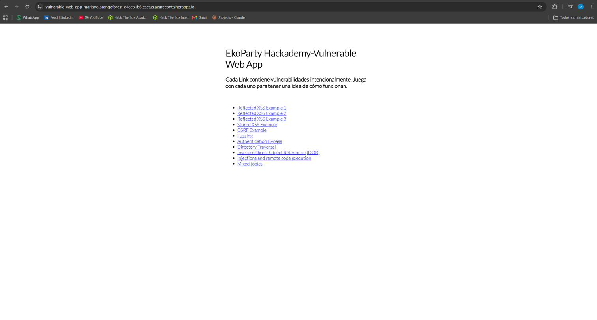

# Proyecto Final — DevSecOps & Cloud Security
### Hackademy Ekoparty | Mariano Acosta

---

## 1. Objetivo del ejercicio

Construir, asegurar y desplegar automáticamente (vía pipeline de CI/CD) la aplicación intencionalmente vulnerable [`vulnerable-web-app`](https://github.com/GinoDevOps/vulnerable-web-app), provista como base por el curso, sobre infraestructura cloud propia.

**Consigna original:**
> Construir una imagen a partir del Dockerfile proporcionado, alojarla automáticamente mediante un pipeline en una plataforma que lo permita, y desplegarla en un proveedor cloud a elección (surge.sh, AWS S3, GCP, Azure o Digital Ocean). El entregable es una URL pública con la app cargada, incluyendo el nombre del alumno.

**Repositorio base:** `github.com/GinoDevOps/vulnerable-web-app`
**Fork de trabajo:** `github.com/M-K0s/vulnerable-web-app`

---

## 2. Arquitectura elegida

```
GitHub (fork M-K0s/vulnerable-web-app)
        │
        │ push a main
        ▼
GitHub Actions (pipeline CI/CD)
   ├─ 1. Build de imagen Docker (Dockerfile actualizado)
   ├─ 2. Login a Docker Hub
   ├─ 3. Push de la imagen a Docker Hub
   └─ 4. Deploy / update en Azure Container Apps
                │
                ▼
     URL pública con el nombre del alumno incluido
```

| Componente | Elección | Alternativa considerada |
|---|---|---|
| Plataforma de despliegue | **Azure Container Apps** | Heroku (sugerido en README original) |
| Registro de imagen | **Docker Hub** | Azure Container Registry (ACR) |
| Imagen base | **node:18-slim** | node:8 (original) / node:18-alpine |
| Orquestación del pipeline | **GitHub Actions** | — (sin alternativa evaluada) |

---

## 3. Decisiones técnicas y justificación

Siguiendo la metodología **Romper → Entender → Proteger → Automatizar**, cada apartamiento respecto de la consigna original queda documentado a continuación, junto con el razonamiento detrás y las alternativas que se consideraron.

### 3.1 Azure Container Apps en lugar de Heroku

**Contexto:** la consigna permite explícitamente Azure como proveedor de despliegue ("se permite utilizar proveedores como surge.sh, AWS S3, Google Cloud, Microsoft Azure, o Digital Ocean"), aunque el README del repo original trae una receta prearmada para Heroku.

**Justificación:** se optó por Azure como una forma de tomar un desafío más cercano a un escenario real de trabajo. Heroku es un PaaS que abstrae deliberadamente buena parte de la infraestructura subyacente (no requiere tocar IAM, redes, ni gestión de secrets de forma explícita), lo cual simplifica el despliegue pero deja afuera justamente el tipo de configuración que se busca practicar en esta etapa del curso: gestión de un Service Principal con permisos acotados, configuración de red y exposición pública, y manejo de secrets en el pipeline. Azure Container Apps exige resolver esas piezas de forma explícita, lo que lo hizo una opción más formativa para este ejercicio puntual.

**Trade-off aceptado:** no existía una receta preescrita para Azure (a diferencia de Heroku, que trae un workflow de GitHub Actions de base en el repositorio original). Esto implicó armar el pipeline completo desde cero, sin una plantilla de referencia, con la carga extra de trabajo y de posibilidad de error que eso conlleva.

### 3.2 Docker Hub en lugar de Azure Container Registry (ACR)

**Contexto:** ACR es la opción "todo Azure", pero tiene un costo fijo mensual (~5 USD/mes en SKU Basic) que corre desde el momento de creación del recurso, independientemente del uso.

**Justificación:** se priorizó no incurrir en ningún gasto para este proyecto. Docker Hub es gratuito para repositorios públicos y es soportado nativamente como origen de imagen por Azure Container Apps — no hay pérdida de funcionalidad en el despliegue, solo un cambio en dónde reside la imagen antes del deploy.

**Trade-off aceptado:** el diagrama de arquitectura deja de ser "todo Azure" — la imagen vive en un servicio de terceros. Se documenta como una decisión consciente de costo, no como un descuido.

### 3.3 Actualización de la imagen base: `node:8` → `node:18-slim`

**Contexto:** el Dockerfile original especifica `node:8`, versión sin soporte desde diciembre de 2019, con CVEs conocidos sin parchear.

**Justificación:**
- Un scanner de imagen (Trivy, Docker Scout) marcaría `node:8` como vulnerabilidad crítica de entrada, algo que convenía evitar en un examen orientado a seguridad.
- La consigna no exige inmutabilidad del Dockerfile ("construir una imagen **a partir de**" el archivo proporcionado, no "sin modificaciones").

**Por qué `slim` y no `alpine`:** `package.json` incluye `bcrypt@5.0.1`, un módulo nativo que compila código C++ contra la libc del sistema durante `npm install`. Alpine usa `musl` en lugar de `glibc` y no incluye herramientas de compilación por defecto (`python3`, `make`, `g++`), lo cual es una causa frecuente y documentada de fallos de build para este tipo de dependencias. `node:18-slim` está basada en Debian (glibc), evitando ese problema sin sacrificar tamaño significativo frente a Alpine (~20MB de diferencia) ni caer en el peso completo de la imagen `node:18` estándar (~1GB).

**Trade-off aceptado:** técnicamente ya no es "el Dockerfile proporcionado" sin modificar. Se documenta explícitamente para diferenciar de un desvío no declarado.

### 3.4 Reordenamiento de capas del Dockerfile

**Cambio:** se separó la copia de `package*.json` (seguida de `npm install`) de la copia del resto del código fuente, y se agregó un `WORKDIR /app` explícito.

**Justificación:** aprovecha el cacheo de capas de Docker — si en una iteración futura solo cambia código HTML/JS de la app (no las dependencias), la capa de `npm install` no se reconstruye, acelerando builds sucesivos en el pipeline de CI. `WORKDIR /app` es una buena práctica estándar que evita escribir archivos directamente en la raíz del contenedor.

---

## 4. Walkthrough — Registro paso a paso

### Paso 1 — Fork del repositorio base

Se realizó fork de `GinoDevOps/vulnerable-web-app` a la cuenta personal, quedando disponible en:
`https://github.com/M-K0s/vulnerable-web-app`

Descripción asignada al fork:
> Fork del proyecto final de DevSecOps (Hackademy Ekoparty) — build, containerización y despliegue automatizado en Azure Container Apps vía GitHub Actions

### Paso 2 — Clonado local

Clonado en entorno de trabajo local (Windows + WSL2 Ubuntu 24.04.3 + VS Code Remote-WSL):


```bash
cd ~
git clone https://github.com/M-K0s/vulnerable-web-app.git
cd vulnerable-web-app
```

### Paso 3 — Revisión del código base

Inspección del `Dockerfile` y `package.json` originales antes de modificar nada, siguiendo el principio de "Entender antes de Automatizar".

**Dockerfile original:**
```dockerfile
FROM node:8
COPY . .
ADD server.js package*.json ./
RUN npm install
EXPOSE 8080
#ENTRYPOINT ["npm", "start"]
CMD node server.js
```

**Dependencias relevantes detectadas (`package.json`):** `express`, `express-handlebars`, `express-session`, `body-parser`, `async`, `request` (deprecado pero funcional), y **`bcrypt`** (módulo nativo — origen del análisis en sección 3.3).

### Paso 4 — Actualización del Dockerfile

**Dockerfile resultante:**
```dockerfile
FROM node:18-slim

WORKDIR /app

COPY package*.json ./
RUN npm install

COPY . .

EXPOSE 8080

CMD ["node", "server.js"]
```

### Paso 5 — Creación de `.dockerignore`

El repo original no incluía `.dockerignore`. Se agregó para evitar que metadata de control de versiones y archivos irrelevantes viajen dentro de la imagen:

```
.git
.gitignore
node_modules
npm-debug.log
README.MD
.github
```

### Paso 6 — Build local de la imagen

```bash
docker build -t vulnerable-web-app:mariano .
```

Build inicial exitoso (23.1s, 5 capas). El paso crítico `RUN npm install` (9.7s) — que se esperaba como punto de fricción por la dependencia nativa `bcrypt` — completó sin errores, confirmando que la elección de `node:18-slim` sobre `node:18-alpine` evitó el problema de compatibilidad glibc/musl anticipado en la sección 3.3.

### Paso 7 — Incidente: fallo en runtime (`primordials is not defined`)

Al correr el contenedor (`docker run`), la imagen buildeaba correctamente pero **crasheaba al iniciar**:

```
ReferenceError: primordials is not defined
    at fs.js:43:5
    at req_ (/app/node_modules/natives/index.js:143:24)
    at Object.<anonymous> (/app/node_modules/graceful-fs/fs.js:1:37)
```

**Diagnóstico:** se abrió una shell interactiva dentro del contenedor para inspeccionar el árbol de dependencias:

```bash
docker run --rm -it --entrypoint bash vulnerable-web-app:mariano
npm ls graceful-fs
```

Resultado: `express-handlebars@2.0.1` (dependencia directa, versión de 2016) arrastra `graceful-fs@3.0.12` como dependencia transitiva. Esa versión de `graceful-fs` usa un mecanismo interno (`natives`) para parchear el módulo `fs` de Node leyendo su código fuente — mecanismo que Node rompió permanentemente al introducir `primordials` en su arquitectura interna (Node ~10/12+). Es una incompatibilidad conocida entre dependencias legacy y runtimes modernos de Node, no un error de configuración del proyecto.

**Resolución aplicada — override de `package.json`:**

```json
"overrides": {
      "graceful-fs": "^4.2.11"
}
```

Se evaluaron dos alternativas:
- **(A) Override de `graceful-fs`** — fuerza la versión moderna en cualquier punto del árbol de dependencias sin tocar `express-handlebars` ni el código de vistas existente. Riesgo bajo: la API pública de `graceful-fs` se mantuvo estable entre 3.x y 4.x.
- **(B) Actualizar `express-handlebars`** a una versión moderna (7.x+) — resuelve el problema de raíz, pero introduce riesgo de *breaking changes* en el motor de plantillas (registro de layouts/helpers), con potencial impacto en las vistas Handlebars existentes, que son código del profesor y no del alumno.

Se optó por **(A)** por ser la intervención mínima suficiente.

**Limpieza adicional:** se eliminó `npm-shrinkwrap.json` (obsoleto, con prioridad de resolución por sobre `package.json`/`package-lock.json`, lo cual habría anulado el `overrides` recién agregado).

**Validación:** rebuild con `--no-cache` para forzar resolución de dependencias desde cero:

```bash
docker rm -f vuln-app-test
docker build --no-cache -t vulnerable-web-app:mariano .
docker run -d -p 8080:8080 --name vuln-app-test vulnerable-web-app:mariano
docker ps        # contenedor en estado "Up"
curl -I http://localhost:8080
```

Resultado: `HTTP/1.1 200 OK`, con `X-Powered-By: Express` y cookie de sesión (`Set-Cookie: sid=...`) presentes en la respuesta — confirmando que la aplicación arranca y sirve contenido correctamente sobre Node 18.

**Nota metodológica:** durante este paso se intentó también correr `npm install` directamente en el entorno local de Windows (fuera del contenedor) para regenerar el lockfile, lo cual falló por un problema de interoperabilidad Windows/WSL2 (el `PATH` resolvió el npm de Windows en lugar del de WSL2 Ubuntu, sobre rutas UNC no soportadas por `cmd.exe`). Este fallo fue irrelevante para el proyecto: el `npm install` real corre dentro del contenedor Linux durante el build de Docker, completamente aislado de ese problema de entorno local.

### Paso 8 — Creación del repositorio en Docker Hub

Se creó el repositorio público `mk0s/vulnerable-web-app-mariano` en Docker Hub, incluyendo el nombre del alumno en el identificador del repositorio (consistente con el requisito de la consigna de identificar el entregable final con nombre propio).

Se generó además un **Personal Access Token** con permisos *Read & Write*, destinado exclusivamente a la autenticación de GitHub Actions contra Docker Hub durante el pipeline de CI/CD — nunca se utiliza la contraseña de la cuenta ni se almacena el token en el código del repositorio (se gestiona como GitHub Secret en un paso posterior).

### Paso 9 — Push manual de validación

Antes de automatizar el push dentro del pipeline, se validó manualmente el flujo completo desde la terminal local, para aislar cualquier problema de credenciales/nombre de repo de los problemas propios de configuración de GitHub Actions:

```bash
docker login -u mk0s
docker tag vulnerable-web-app:mariano mk0s/vulnerable-web-app-mariano:latest
docker push mk0s/vulnerable-web-app-mariano:latest
```

Resultado: login exitoso mediante Access Token (no contraseña de cuenta), y push completo de todas las capas de la imagen, con digest confirmado (`sha256:3311c777...`). Imagen disponible públicamente en `docker.io/mk0s/vulnerable-web-app-mariano:latest`.

### Paso 10 — Autenticación en Azure y creación del Resource Group

**Incidente menor:** `az login` estándar falló en WSL2 con error `gio: ... Operation not supported` — WSL2 no tiene un navegador GUI asociado por defecto para el flujo de autenticación interactiva. Resuelto con el flujo alternativo de device code:

```bash
az login --use-device-code
```

Autenticación completada contra la única suscripción disponible (`Azure subscription 1`), confirmada como activa (`isDefault: true`, `state: Enabled`).

**Creación del Resource Group**, siguiendo una convención de nomenclatura clara (`rg-<propósito>`):

```bash
az group create --name rg-vulnerable-web-app --location eastus
```

Resultado: `"provisioningState": "Succeeded"`.

### Paso 11 — Creación del Container Apps Environment

Registro de proveedores necesarios en la suscripción:

```bash
az provider register --namespace Microsoft.App --wait
az provider register --namespace Microsoft.OperationalInsights --wait
```

Creación del environment (genera automáticamente un workspace de Log Analytics para logging centralizado):

```bash
az containerapp env create \
  --name env-vulnerable-web-app \
  --resource-group rg-vulnerable-web-app \
  --location eastus
```

Resultado: `"provisioningState": "Succeeded"`, plan de facturación confirmado como **Consumption** (pago por uso real, con free grant mensual — ver sección 3.5). Dominio base asignado: `orangeforest-a4acb1b6.eastus.azurecontainerapps.io`.

### Paso 12 — Creación del Container App y validación de costo cero

```bash
az containerapp create \
  --name vulnerable-web-app-mariano \
  --resource-group rg-vulnerable-web-app \
  --environment env-vulnerable-web-app \
  --image docker.io/mk0s/vulnerable-web-app-mariano:latest \
  --target-port 8080 \
  --ingress external \
  --min-replicas 0 \
  --max-replicas 1 \
  --cpu 0.25 \
  --memory 0.5Gi
```

Resultado: `"provisioningState": "Succeeded"`, `"runningStatus": "Running"`. URL pública asignada:

**`https://vulnerable-web-app-mariano.orangeforest-a4acb1b6.eastus.azurecontainerapps.io/`**

**Validación de despliegue manual:**

```bash
curl -I https://vulnerable-web-app-mariano.orangeforest-a4acb1b6.eastus.azurecontainerapps.io/
```

Resultado: `HTTP/2 200`, con `x-powered-by: Express` y cookie de sesión activa — la aplicación responde correctamente desde infraestructura Azure real, con el nombre del alumno incluido tanto en el nombre del recurso como en la URL final, cumpliendo el requisito explícito de la consigna.

### 3.5 Confirmación de costo — Azure Container Apps plan Consumption

Se verificó contra documentación oficial de Microsoft que Azure Container Apps (plan Consumption) no es un "free tier" temporal, sino un free grant mensual permanente y recurrente por suscripción: los primeros 180.000 vCPU-segundos, 360.000 GiB-segundos y 2 millones de requests por mes no generan cargo. Este uso gratuito no aparece en la factura salvo que se supere.

La configuración `--min-replicas 0` es la variable crítica para mantenerse dentro de este free grant: permite que la aplicación escale a cero réplicas en ausencia de tráfico, sin cargos de cómputo durante ese tiempo (con un cold start de pocos segundos en la primera request tras inactividad). Configurar un mínimo de réplicas mayor a cero evitaría el scale-to-zero y generaría cargos de tarifa idle continuos (estimado en documentación de terceros: ~13 USD/mes para una réplica de 0.5 vCPU / 1 GiB corriendo en idle todo el mes), por lo que se descarta explícitamente para este proyecto.

### Paso 13 — Creación del Service Principal para GitHub Actions

Para que el pipeline de CI/CD pueda autenticarse contra Azure sin usar credenciales de usuario personal, se creó un **Service Principal** con permisos acotados exclusivamente al Resource Group del proyecto, siguiendo el principio de mínimo privilegio:

```bash
az ad sp create-for-rbac \
  --name sp-github-actions-vulnerable-web-app \
  --role contributor \
  --scopes /subscriptions/<subscription-id>/resourceGroups/rg-vulnerable-web-app \
  --sdk-auth
```

- Rol **Contributor** (permite crear/modificar recursos) en lugar de **Owner** — no requiere ni otorga permisos de gestión de acceso a otras identidades.
- `--scopes` limitado al Resource Group específico del proyecto, no a la suscripción completa.
- Salida en formato `--sdk-auth`, compatible directamente con la acción `azure/login` de GitHub Actions.

El JSON generado (contiene `clientSecret`, credencial sensible equivalente a una contraseña) se almacena exclusivamente como GitHub Secret — nunca en el código del repositorio ni en este documento.

### Paso 14 — Configuración de GitHub Secrets

Se cargaron en `Settings → Secrets and variables → Actions` del repositorio fork los tres secrets necesarios para que el pipeline se autentique sin exponer credenciales en el código:

| Secret | Contenido |
|---|---|
| `DOCKERHUB_USERNAME` | usuario de Docker Hub |
| `DOCKERHUB_TOKEN` | Personal Access Token de Docker Hub (permisos Read & Write) |
| `AZURE_CREDENTIALS` | JSON de salida del Service Principal (`az ad sp create-for-rbac --sdk-auth`) |

### Paso 15 — Workflow de GitHub Actions

Se reemplazó el contenido de `.github/workflows/deploy.yml` (originalmente orientado a Heroku) por un pipeline propio para Azure:

```yaml
name: Build, Push and Deploy to Azure Container Apps

on:
  push:
    branches: [master]

jobs:
  build-push-deploy:
    runs-on: ubuntu-latest
    steps:
      - name: Checkout repository
        uses: actions/checkout@v4
      - name: Log in to Docker Hub
        uses: docker/login-action@v3
        with:
          username: ${{ secrets.DOCKERHUB_USERNAME }}
          password: ${{ secrets.DOCKERHUB_TOKEN }}
      - name: Build and push Docker image
        uses: docker/build-push-action@v6
        with:
          context: .
          push: true
          tags: ${{ secrets.DOCKERHUB_USERNAME }}/vulnerable-web-app-mariano:latest
      - name: Log in to Azure
        uses: azure/login@v2
        with:
          creds: ${{ secrets.AZURE_CREDENTIALS }}
      - name: Deploy new image to Azure Container Apps
        uses: azure/CLI@v2
        with:
          inlineScript: |
            az containerapp update \
              --name vulnerable-web-app-mariano \
              --resource-group rg-vulnerable-web-app \
              --image docker.io/${{ secrets.DOCKERHUB_USERNAME }}/vulnerable-web-app-mariano:latest
```

**Nota de diseño:** se usa el tag fijo `:latest` para simplicidad en este ejercicio. Se documenta como limitación conocida: en un pipeline productivo real, taguear con `${{ github.sha }}` sería más robusto, ya que Azure Container Apps no siempre garantiza detectar cambios de contenido bajo un tag idéntico repetido — con SHA único por commit, cada deploy queda inequívocamente diferenciado. Se mantiene `:latest` por ahora dado el bajo riesgo en un entorno de examen de baja frecuencia de cambios.

**Incidente — mismatch de rama:** el trigger inicial estaba configurado como `branches: [main]`, pero la rama por defecto del fork es `master` (heredada del repo original). Corregido en un segundo commit tras detectar que el primer push no disparó ningún workflow run.

**Incidente — Actions deshabilitado por defecto:** GitHub deshabilita automáticamente los workflows heredados al forkear un repositorio (medida de seguridad para evitar ejecución no consentida de pipelines con acceso a secrets). Se habilitó explícitamente desde la pestaña Actions del fork.

**Validación end-to-end:** tras un push trivial (edición de `README.MD`) con Actions ya habilitado y el trigger corregido, el pipeline ejecutó exitosamente sus 5 steps (Checkout → Login Docker Hub → Build & Push → Login Azure → Deploy) en 59 segundos totales, con estado **Success**. Confirmado que el flujo completo — de `git push` a actualización en Azure — corre sin intervención manual.

### Paso 16 — Incidente: `:latest` no dispara nueva revisión en Azure

Pese al pipeline en verde, se verificó contra Azure (`az containerapp revision list`) que **no se había generado ninguna revisión nueva** — solo existía la revisión creada manualmente antes de automatizar nada.

**Causa raíz:** Azure Container Apps decide si crear una revisión nueva comparando el *template* de configuración (que incluye la referencia de imagen completa como string) contra la revisión activa. Como el workflow reutilizaba siempre el mismo tag literal (`:latest`), el template resultaba idéntico byte a byte entre despliegues, aunque el contenido real de la imagen en Docker Hub hubiera cambiado — Azure no tiene forma de detectar ese cambio de contenido bajo un tag inmutable en el string. Esto confirma en la práctica la limitación que se había anticipado y documentado al escribir el workflow original (sección "Nota de diseño", Paso 15).

**Fix aplicado:** se modificó el workflow para taguear la imagen con dos tags en cada build — `:latest` (referencia estable) y `:${{ github.sha }}` (hash único de 40 caracteres del commit) — y se cambió el paso de deploy para desplegar explícitamente por el tag del SHA, no por `:latest`:

```yaml
tags: |
  ${{ secrets.DOCKERHUB_USERNAME }}/vulnerable-web-app-mariano:latest
  ${{ secrets.DOCKERHUB_USERNAME }}/vulnerable-web-app-mariano:${{ github.sha }}
...
--image docker.io/${{ secrets.DOCKERHUB_USERNAME }}/vulnerable-web-app-mariano:${{ github.sha }}
```

Como cada commit tiene un SHA distinto, el string de imagen recibido por Azure es garantizadamente único en cada deploy, forzando la creación de una revisión nueva sin falta.

**Incidente secundario — error de sintaxis YAML:** el primer intento de aplicar este fix produjo un error de parseo (`Invalid workflow file... error in your yaml syntax on line 2`), atribuible a un problema de indentación al pegar el bloque nuevo (YAML es sensible a espacios). Corregido y re-pusheado exitosamente en el intento siguiente.

**Validación final:**

```bash
az containerapp show \
  --name vulnerable-web-app-mariano \
  --resource-group rg-vulnerable-web-app \
  --query "properties.template.containers[0].image" -o tsv
```

Resultado: `docker.io/mk0s/vulnerable-web-app-mariano:5bf2743d9f24e53d6f88981d5099160b753cf9e4` — el hash coincide exactamente con el SHA del commit que disparó el pipeline exitoso, confirmando que Azure desplegó la imagen correcta generada por ese build específico (no una copia cacheada).

Verificación de disponibilidad pública tras el fix:

```bash
curl -I https://vulnerable-web-app-mariano.orangeforest-a4acb1b6.eastus.azurecontainerapps.io/
```

Resultado: `HTTP/2 200`, aplicación sirviendo contenido correctamente sobre la revisión desplegada por el pipeline automatizado.

**Conclusión de la validación end-to-end:** el ciclo completo — `git push` → build de imagen → push a Docker Hub con tag único por commit → login a Azure vía Service Principal → actualización del Container App con revisión nueva verificable → aplicación pública respondiendo — quedó demostrado sin intervención manual, cumpliendo el requisito central de la consigna ("alojar automáticamente... mediante un pipeline").

---

## 5. Cómo verificar el entregable

Toda la verificación es posible sin necesidad de acceso a la suscripción de Azure del alumno, dado que los recursos relevantes (repositorio de código y registro de imagen) son públicos:

1. **URL pública de la aplicación:**
   `https://vulnerable-web-app-mariano.orangeforest-a4acb1b6.eastus.azurecontainerapps.io/`
   Debe mostrar la lista de ejercicios de seguridad (Reflected XSS, Stored XSS, CSRF, IDOR, etc.), en línea con las imágenes de referencia de la consigna.

   

2. **Repositorio de código (público):**
   `https://github.com/M-K0s/vulnerable-web-app`
   La pestaña **Actions** permite ver el historial completo de ejecuciones del pipeline, incluyendo logs de cada paso (build, push, deploy).

3. **Registro de imagen (público):**
   `https://hub.docker.com/r/mk0s/vulnerable-web-app-mariano`
   La pestaña **Tags** muestra las imágenes generadas por el pipeline, cada una etiquetada con el hash del commit que la originó.

**Nota sobre el primer acceso:** el Container App está configurado con escalado a cero réplicas (`--min-replicas 0`) cuando no hay tráfico entrante, como medida consciente de control de costos. Esto implica que, si la aplicación estuvo inactiva por un tiempo, la primera solicitud puede demorar unos segundos adicionales mientras el contenedor se reactiva (*cold start*). Este comportamiento es esperado y no indica una falla.

---

## 6. Cierre

Los objetivos definidos en la consigna quedaron cumplidos: la imagen se construye a partir del Dockerfile del proyecto (con las modificaciones de seguridad y compatibilidad detalladas y justificadas en la sección 3), se aloja automáticamente mediante un pipeline de GitHub Actions, y se despliega en Azure Container Apps bajo una URL pública que incluye el nombre del alumno. El pipeline fue validado de punta a punta: un `git push` dispara el build, la publicación de la imagen en Docker Hub y la actualización del recurso en Azure sin intervención manual, con evidencia concreta (hash de commit coincidente entre la imagen desplegada y el pipeline que la generó) de que el ciclo funciona como se espera.

Quedan dos aspectos identificados como mejoras posibles a futuro, fuera del alcance necesario para este entregable: reemplazar Docker Hub por Azure Container Registry si en algún momento se dispusiera de presupuesto para ello, y evaluar un mecanismo de tagging más sofisticado (por ejemplo, tags semánticos además del hash de commit) si el proyecto creciera en complejidad.

---

*Última actualización del documento: fin del proceso de desarrollo, previo al envío del entregable.*
